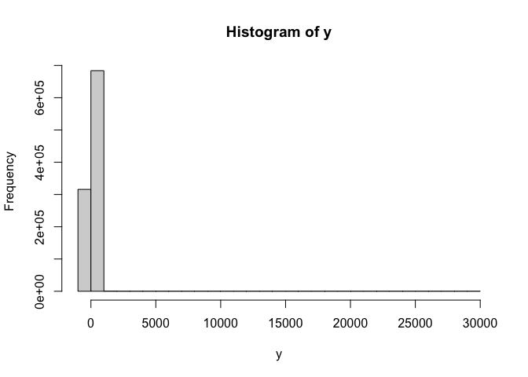

# fqr: Fast (Approximate) Quantile Regression

<!-- badges: start -->

[](https://codecov.io/gh/be-green/fqr?branch=main)
[](https://github.com/be-green/fqr/actions)
<!-- badges: end -->

The `fqr` package makes quantile regression fast and scaleable using
accelerated gradient descent, with code based on the implementation in the [conquer package](https://github.com/XiaoouPan/conquer) and [paper](https://doi.org/10.1016/j.jeconom.2021.07.010). This project began as a user-friendly edit of that package for use in the [quantspace package](https://github.com/be-green), but using a Huber approximation instead of a kernel-smoothed loss function, adding in accelerated gradient descent and additional convergence checks.

`fqr`can handle quantile regression problems on the order of 10 million rows
and 100 columns in less than a minute, and can exactly match existing
implementations on small problems.

While the quantile loss function isn’t differentiable, you can get an
arbitrarily close smooth approximation by replacing the “check” function
with an appropriately tilted least squares approximation for a small
neighborhood around the origin. As the size of that window goes to zero,
you have your check function back!

The package uses 2 stopping rules to assess convergence: the maximum
value of the gradient vector (for the coefficients of the quantile
regression) and the relative change in the loss function (scaled by the
step size).

`fqr` is substantially faster than the `quantreg` package’s simplex and
interior point methods (e.g. “br” or “pfn”), especially for large
problems, and is comparable to the `conquer` package, though it tends to be slightly slower due to the default accuracy tolerance settings. The algorithm implemented via the Armadillo library for linear
algebra in C++. It also has no dependencies other than base R and (if
building from source) a C++ compiler.

## Installation

You can install the fqr package from github by running

``` r
# get remotes if needed:
# install.packages("remotes")

remotes::install_github("be-green/fqr")
```

## Basic Use

The `fqr` package uses the same basic formula interface that `lm` does,
with standard errors calculated based on subsampling.

``` r
library(fqr)
data(rock)

fqr(area ~ peri, data = rock, tau = c(0.25, 0.5, 0.75))
#> Tau:  0.25 
#>              Coefficient           SE
#> (Intercept) 5.213347e+03 500.04947110
#> peri        4.185437e-02   0.01041795
#> Tau:  0.5 
#>              Coefficient           SE
#> (Intercept) 7348.5642814 4.255263e+02
#> peri           0.0494302 7.136446e-03
#> Tau:  0.75 
#>              Coefficient           SE
#> (Intercept) 8737.2838152 3.990133e+02
#> peri           0.0410983 4.911924e-03
```

To turn off standard errors (and just get point predictions), you can
set `se = F`.

``` r
fqr(area ~ peri, data = rock, se = F, tau = c(0.25, 0.5, 0.75))
#> Tau:  0.25 
#>              Coefficient SE
#> (Intercept) 5.214035e+03 NA
#> peri        4.133264e-02 NA
#> Tau:  0.5 
#>              Coefficient SE
#> (Intercept) 7.350090e+03 NA
#> peri        4.890847e-02 NA
#> Tau:  0.75 
#>              Coefficient SE
#> (Intercept) 8.739148e+03 NA
#> peri        4.057656e-02 NA
```

## Benchmarks

Ok, but *how* fast is this approach? Let’s just take some point
estimates and see how it goes.

### Medium N, Medium P

But with all of this done, let’s compare to some benchmarks from the
`sfn` and `pfn` algorithms, which are currently the fastest in the
`quantreg` package.

``` r
# simulate some data, 101 x 100,000
p <- 20
n <- 1e6
beta <- rnorm(p + 1)

x <- cbind(1, matrix(rnorm(p * n), ncol = p, nrow = n))
y <- x %*% beta + exp(rnorm(n, sd = 2))

# let's take a look at what this looks like
hist(y)
```



Ok so we have some *very* skewed data! Perfect for median regression.

``` r
start = proc.time()
# lower level version that just takes design matrix
fit <- fit_fqr(x, y, tau = 0.5, se = F)
end = proc.time()
end - start
#>    user  system elapsed 
#>  15.429   0.388   3.708
```

I attempted to run the same thing with the `quantreg` package, with the
method advised for large datasets, like so:

``` r
# newton interior point method w/ pre-processing
start <- proc.time()
fit_pfn <- quantreg::rq.fit.pfn(x, y, tau = 0.5)
end <- proc.time()
end - start
```

but I killed it after 20 minutes (feel free to try this yourself!). I
guess that leaves us with a comparison between \~3-5 seconds for `fqr`
and a lower bound of 20 minutes for `pfn`?

# Big N, Big P

Let’s benchmark with a bigger set of columns.

``` r
p <- 100
n <- 1e6
beta <- rnorm(p + 1)

x <- cbind(1, matrix(rnorm(p * n), ncol = p, nrow = n))
y <- 10 + x %*% beta + exp(rnorm(n, sd = 2))
```

``` r
start = proc.time()
fit <- fit_fqr(x, y, tau = 0.5, se = F)
end = proc.time()
end - start
#>    user  system elapsed 
#> 152.218   3.381  24.449
```

I’m not going to run the quantreg `pfn` algorithm since it was so slow
for the last problem. `fqr` is a little bit slower as the columns get
big, taking 25-30 seconds.

### Big N, Small P

Let’s try a more manageable set of dimensions, with *lots* of
observations.

``` r
p <- 10
n <- 1e7
beta <- rnorm(p + 1)

x <- cbind(1, matrix(rnorm(p * n), ncol = p, nrow = n))
y <- x %*% beta + exp(rnorm(n, sd = 2))

start = proc.time()
fit <- fit_fqr(X = x, y = y, tau = 0.5, se = F)
end = proc.time()
end - start
#>    user  system elapsed 
#>  93.293   2.060  20.329
```

I attempted to do the comparable thing for the `pfn` algorithm:

``` r
start = proc.time()
fit <- quantreg::rq.fit.pfn(x = x, y = y, tau = 0.5)
end = proc.time()
end - start
```

…but I killed the process after 15 minutes or so.

# Medium-scale Problem

Ok, so we haven’t been able to run quantreg on these datasets, let’s see
how it does with a sort of medium-scale problem. Let’s use the same DGP.

``` r
p <- 10
n <- 1e5
beta <- rnorm(p + 1)

x <- cbind(1, matrix(rnorm(p * n), ncol = p, nrow = n))
y <- x %*% beta + exp(rnorm(n, sd = 2))

start = proc.time()
fit <- fit_fqr(X = x, y = y, tau = 0.5, se = F)
end = proc.time()
end - start
#>    user  system elapsed 
#>   0.869   0.070   0.230
```

``` r
start = proc.time()
fit_pfn <- quantreg::rq.fit.pfn(x = x, y = y, tau = 0.5)
#> Warning in quantreg::rq.fit.pfn(x = x, y = y, tau = 0.5): Too many fixups:
#> doubling m
end = proc.time()
end - start
#>    user  system elapsed 
#>   1.574   0.383   1.790
```

The coefficients match out to the 4th or 5th decimal place:

``` r
max(abs(fit$coefficients - fit_pfn$coefficients))
#> [1] 0.000122037
```

``` r
min(abs(fit$coefficients - fit_pfn$coefficients))
#> [1] 2.132279e-06
```

### Small Problems

It can also be faster for small problems, and with conservative
tolerance parameters will come extremely close to the default `quantreg`
outputs. Here’s an example:

``` r
# simulate some data, 101 x 10,000,000
p <- 3
n <- 10000
beta <- rnorm(p)
x <- cbind(matrix(rnorm(p * n), ncol = p, nrow = n))
y <- 10 + x %*% beta + exp(rnorm(n, sd = 2))

microbenchmark::microbenchmark(
  fqr_fit <- fqr(y ~ ., se = F, beta_tol = 0, check_tol = 0,
                 data = data.frame(y = y, x)),
  br_fit <- quantreg::rq(y ~ ., tau = 0.5, 
                    data = data.frame(y = y, x), method = "br"),
                    times = 100
)
#> Unit: milliseconds
#>                                                                                          expr
#>  fqr_fit <- fqr(y ~ ., se = F, beta_tol = 0, check_tol = 0, data = data.frame(y = y,      x))
#>     br_fit <- quantreg::rq(y ~ ., tau = 0.5, data = data.frame(y = y,      x), method = "br")
#>       min       lq     mean  median       uq      max neval
#>  19.48368 20.30906 21.50476 20.8557 21.74249 34.92471   100
#>  75.13717 76.34309 80.20037 77.4336 82.66268 98.75256   100
```

The coefficients match out to 4 decimal places:

``` r
fqr_fit$coefficients - br_fit$coefficients
#>               [,1]
#> [1,] -0.0009031814
#> [2,]  0.0012812620
#> [3,] -0.0004906861
#> [4,] -0.0002251114
```

And the check loss is nearly identical:

``` r
check <- function (x, tau = 0.5) {
  sum(x * (tau - (x < 0)))
}

check(fqr_fit$residuals) -  check(br_fit$residuals)
#> [1] 0.0001522271
```

Still, though, the speed gains are most noticeable once N and P are
“medium” or larger (e.g. for N &lt; 300, probably just use quantreg).
